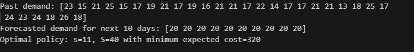

# Demand & Inventory Forecasting

## 📌 Overview
This project combines **machine learning–based demand forecasting** with **inventory policy optimisation**.  
It demonstrates how accurate demand forecasts can be integrated into inventory control to minimise total expected cost.

Key features:
- **Machine Learning (Linear Regression)** for daily demand forecasting.
- **Inventory Policies**: (s, S) continuous review policy.
- **Cost Evaluation**: holding cost + shortage cost.

## 🎯 Objectives
- Forecast **daily demand** using historical data.
- Select an inventory policy (s, S) that minimises **expected inventory costs**.
- Evaluate how forecast accuracy influences policy choice.
- Provide a **decision support tool** for inventory planning.

## 🛠️ Methodology
1. Generate synthetic historical demand data.
2. Train a **linear regression model** to forecast future demand.
3. Simulate different **inventory policies (s, S)**.
4. Compute total costs (holding + shortage).
5. Choose the **optimal policy** with minimum cost.

## 📊 Key Results
- Historical demand was successfully forecasted with ML.
- The optimal inventory policy was found to be:



## 🚀 How to Run
```bash
python demand_inventory_forecasting.py
